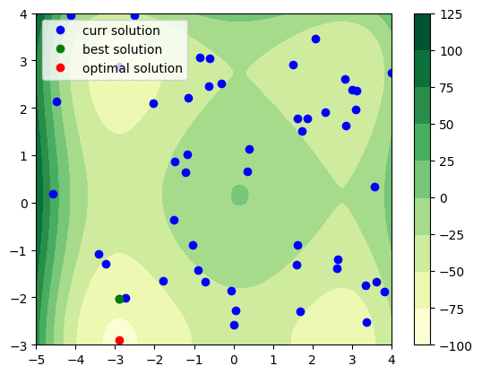
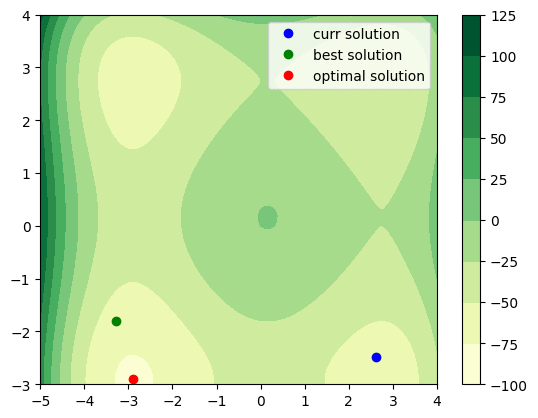
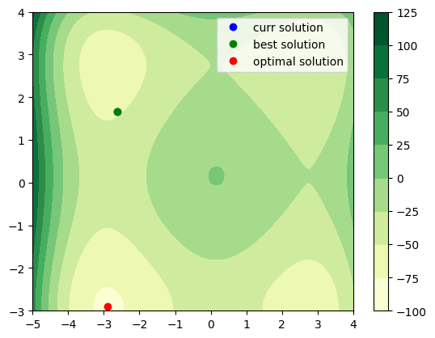
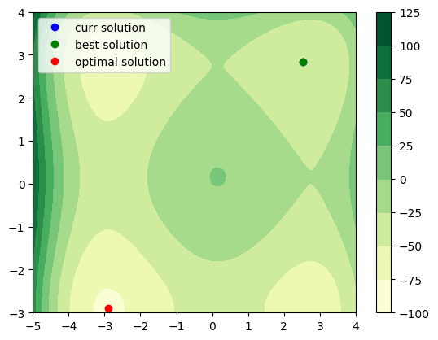

Plot Search Points
==================

We can plot search points to use `callback` option of Solver.

SFLA
----

ScipySearch
-----------

OptunaTPESearch
---------------

RandomSearch
------------

.. code-block:: python

   import os

   import numpy as np
   import matplotlib.pyplot as plt

   import flopt
   from flopt import Variable, Problem, Solver, CustomExpression

   class Plot2DFunc:
       def __init__(self, func, xlim, ylim, opt=None, save_prefix=None):
           self.ix = 0
           self.func = func
           self.xlim = xlim
           self.ylim = ylim
           self.opt = opt
           self.save_prefix = save_prefix
           self.fig, self.ax = plt.subplots()

           # plot contour of func
           im = self.plotFunc(self.ax)
           self.fig.colorbar(im)

       def plotFunc(self, ax):
           # X, Y, Z
           interval = 0.1
           x = np.arange(self.xlim[0], self.xlim[1]+interval, interval)
           y = np.arange(self.ylim[0], self.ylim[1]+interval, interval)
           Z = np.zeros((len(y), len(x)))
           for x_ix in range(len(x)):
               for y_ix in range(len(y)):
                   Z[y_ix, x_ix] = self.func(x[x_ix], y[y_ix])
           X, Y = np.meshgrid(x, y)
           im = self.ax.contourf(X, Y, Z, cmap='YlGn')
           return im

       def plot(self, solutions, best_solution, best_obj_value):
           # solution
           x = [solution[0] for solution in solutions]
           y = [solution[1] for solution in solutions]
           self.ax.plot(x, y, 'o', label='curr solution', color='blue')

           # best solution
           x, y = best_solution[0], best_solution[1]
           self.ax.plot(x, y, 'o', label='best solution', color='green')

           # optimal solution
           if self.opt is not None:
               x, y = opt
               self.ax.plot(x, y, 'o', label='optimal solution', color='red')

           self.ax.legend()

       def savefig(self):
           if self.save_prefix is not None:
               filename = self.save_prefix + f'{self.ix:0>5d}' + '.png'
               self.fig.savefig(filename, bbox_inches='tight')
               self.ix += 1

       def __call__(self, solutions, best_solution, best_obj_value):
           self.plot(solutions, best_solution, best_obj_value)
           self.savefig()
           self.ax.lines = list()  # remove scatter points

   if __name__ == '__main__':
       from math import sin, sqrt
       def test_func(x1, x2):
           return sum(x**4-16*x**2+5*x for x in [x1, x2]) /2

       xlim = (-5, 4)
       ylim = (-3, 4)
       opt = (-2.903534, -2.903534)
       x = Variable(name=f'x', lowBound=xlim[0], upBound=xlim[1], cat='Continuous')
       y = Variable(name=f'y', lowBound=ylim[0], upBound=ylim[1], cat='Continuous')

       prob = Problem()
       prob += CustomExpression(test_func, [x, y])

       # 1. specific algorithm
       # algo = 'SFLA'
       # plot_2d_func = Plot2DFunc(
       #     test_func, xlim, ylim, opt=opt, save_prefix=f'./{algo}/'
       # )
       # solver = Solver(algo=algo)
       # solver.setParams(n_trial=10, callbacks=[plot_2d_func])
       # prob.solve(solver, msg=True)

       # 2. all algorithm
       algos = [
           'RandomSearch',
           'OptunaTPESearch',
           'OptunaCmaEsSearch',
           'HyperoptTPESearch',
           'SFLA',
           'ScipySearch'
       ]
       for algo in algos:
           x.setRandom()
           y.setRandom()
           os.makedirs(algo, exist_ok=True)
           plot_2d_func = Plot2DFunc(
               test_func, xlim, ylim, opt=opt, save_prefix=f'./{algo}/'
           )
           solver = Solver(algo=algo)
           solver.setParams(n_trial=50, callbacks=[plot_2d_func])
           prob.solve(solver, msg=True)

In addition, you can use imagemagick, you can create gif animation from images to run

.. code-block:: shell

  convert -layers optimize -loop 0 -delay 40 *.png search.gif

in each solver directory.
